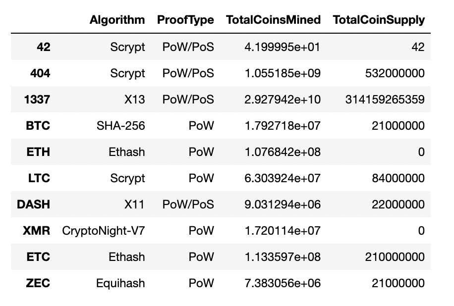
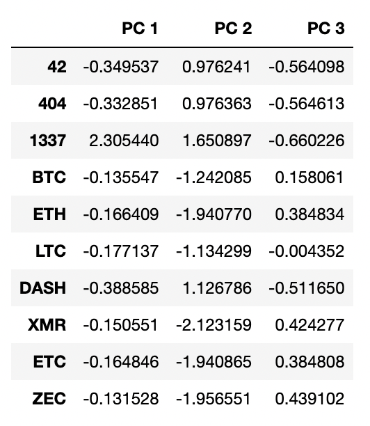
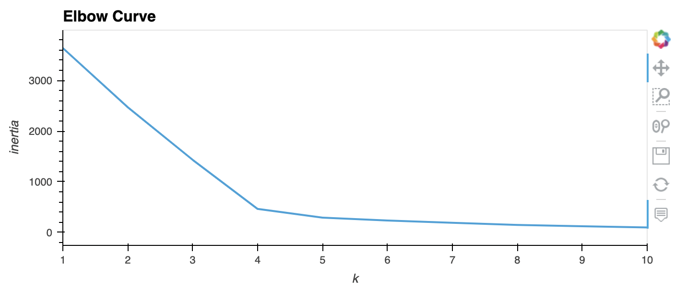
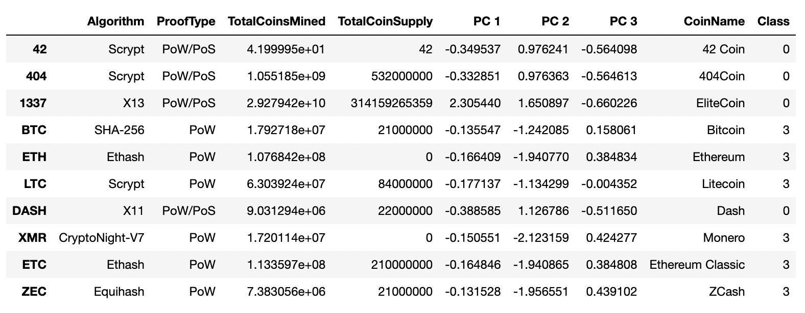
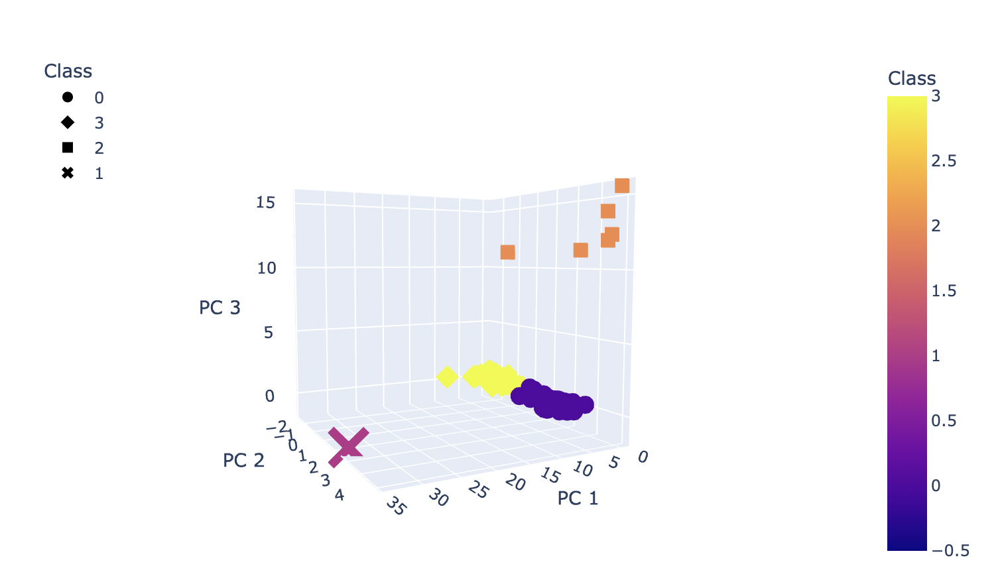
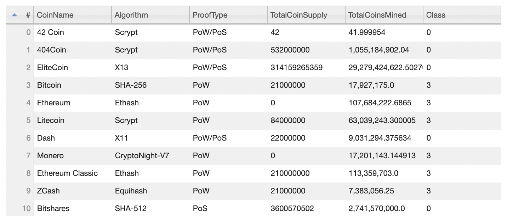
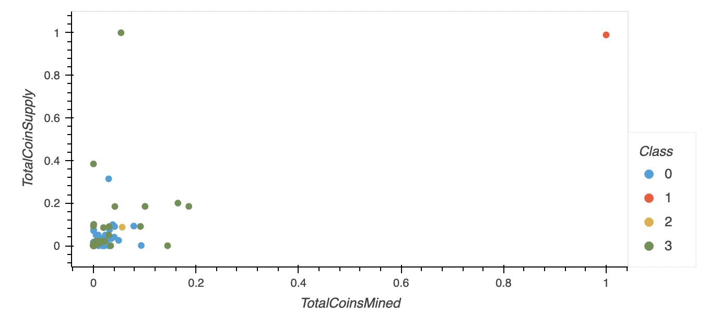

# Cryptocurrencies

## Project Overview
In this challenge we are using unsupervised machine learning to process cryptocurrency data. 

## Results

### Deliverable 1: Preprocessing the Data for PCA

### Deliverable 2: Reducing Data Dimensions Using PCA

### Deliverable 3: Clustering Crytocurrencies Using K-Means

### Deliverable 4: Visualizing Cryptocurrencies Results

